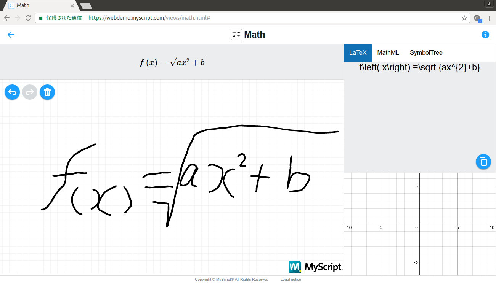

Qiitaで数式を書きましょう
## TeX式を簡単に作成する

https://webdemo.myscript.com/views/math.html#
ここで数式を手書きで書くとTeX式に直してくれます




### Qiitaで書く

先のページで作ったLaTeX式をコピーします。

```
f\left( x\right) =\sqrt {ax^{2}+b}


```

この数式をQiitaで書いてみます。


>
>「 TeXで作った式 $ f\left( x\right) =\sqrt {ax^{2}+b} $ です 」
>
>

と書くと

「 TeXで作った式 @<m>{ f\left( x\right) =\sqrt {ax^{2\\}+b\\} } です 」

となります。

ブロック書式で書くには


>\```math
>
>「 TeXで作った式  f\left( x\right) =\sqrt {ax^{2}+b}  です 」
>
>\```

と書くと

//texequation{
「 TeXで作った式  f\left( x\right) =\sqrt {ax^{2}+b}  です 」
//}

となります。
