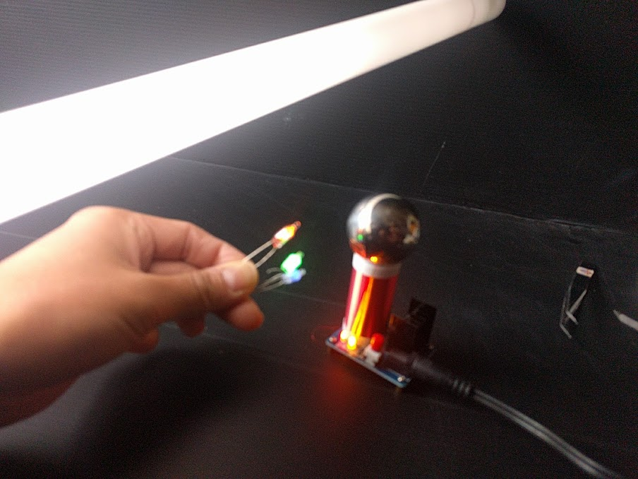

組版システムReVIEWでQiitaから同人誌原稿を作る
## markdownからReVIEW

ReVIEW+markdown で数式の入った薄い本を書く
http://qiita.com/nanbuwks/items/9b00e8012e328de6e440
というのを書きました。

何人かでこういうのやるときに、オンライン投稿するやりかたを考えます。

## Qiitaで書くメリット

Qiita ってよくできていて、割とラフな操作でもいい感じに作ってくれます。

- オンラインで投稿、書いてる途中でリアルタイムにレンダリング結果を確認
- 画像ドラッグ&ドロップで投稿できる
- URLとか自動でリンクに変換してくれる

これを使うやり方を考えてみました。

## catalog.yml

章立てはこうなってます

```
PREDEF:

CHAPS:
  - 1.re

APPENDIX:

POSTDEF:
```


ここの、CHAPSに複数人の原稿を登録するという感じです。

## ひとつの記事を元に原稿を作ってみる

Pi board (Single Board Computer) and Allwinner
http://qiita.com/nanbuwks/items/7f5fd126b8581e6d1a74

を元にしてみます。

まず、

```
review-init piallwinner
cd piallwinner
```
catalog.ymlと　config.yml を編集しておきます。

図をダウンロードします

```
cd images
wget http://qiita.com/nanbuwks/items/7f5fd126b8581e6d1a74 -k -H -r -l 1 -nH -nd -A png,PNG,jpg,JPG,jpeg,JPEG,html  -R txt 
cd ..
```

markdownファイルをダウンロードします。

```
wget http://qiita.com/nanbuwks/items/7f5fd126b8581e6d1a74.md
```

imgファイルをローカルに変換します。

```
ruby qiitamd.rb 7f5fd126b8581e6d1a74.md > 1.md
md2review 1.md > 1.re
rake pdf 
```

変換するスクリプト qiitamd.rb です

```
##!/usr/bin/env ruby

while line = gets
  line.chomp!
  if md1 = line.match(/(^!\[.*?\]\()/)
    if md2 = line.match(/([^\/]*\))/)
##      puts line
##      print md1[0],"\n"
##      print md1[1],"\n"
##      print md2[0],"\n"
##      print md2[1],"\n"
##      print "\n"
##      print md2[0],md1[0],"{\n"
      print md1[0]
      print "images/"
      print md2[1]
      print "\n"
    else
      puts line
    end
  else
   puts line
  end
end

```


## 複数の記事を元に原稿を作ってみる


```
PREDEF:

CHAPS:
  - 1.re
  - 2.re
  - 3.re

APPENDIX:

POSTDEF:
```

として、2.re や 3.re に上のような原稿を当てはめるといいでしょう。

## 画像を縮小する

Qiitaは画像をアップロードすると、はみ出る画像は横幅100%でビューするように画面を作ってくれます。紙媒体の場合は多くは100%だと良くないですね。50%ぐらいの大きさを使うようにするには？

通常の画像をアップロードすると以下のようなmarkdownとなります。
```

```


Qiitaでは、imgタグに書き換えると小さくなります。
```

```


この解決方法は、GitHubなどでも同様です。
タグをいちいち書き換えないといけないのでメンドクサイですね。
markdownの拡張でできないかと思ったのですがそういうのは無さそうです。

仕方がないので、Qiita上では100%で表示されるけれども、PDFに変換した時に任意の大きさになるようにする。

「画像を初期化するスクリプト」
http://qiita.com/nanbuwks/items/9b00e8012e328de6e440#%E7%94%BB%E5%83%8F%E3%82%92%E7%B8%AE%E5%B0%8F%E3%81%99%E3%82%8B%E3%82%B9%E3%82%AF%E3%83%AA%E3%83%97%E3%83%88

を使うと、
[scale=0.5]

```
[scale=0.5]
```

と書けば、Qiita上では大きく、紙媒体に印刷したときには50%で印刷される。
けれども
[scale=0.5]というのが表示されてしまう。

少し書式を変更。

```
[]( scale=0.5 )
```
とした。

[]( scale=0.5 )

しかしながら md2review でエラーが起こる

```
 md2review qiita2review2.md 
/var/lib/gems/2.3.0/gems/md2review-1.11.0/lib/redcarpet/render/review.rb:299:in `remove_inline_markups': undefined method `gsub' for nil:NilClass (NoMethodError)
	from /var/lib/gems/2.3.0/gems/md2review-1.11.0/lib/redcarpet/render/review.rb:191:in `link'
	from /var/lib/gems/2.3.0/gems/md2review-1.11.0/lib/md2review/markdown.rb:13:in `render'
	from /var/lib/gems/2.3.0/gems/md2review-1.11.0/lib/md2review/markdown.rb:13:in `render'
	from /var/lib/gems/2.3.0/gems/md2review-1.11.0/bin/md2review:54:in `<top (required)>'
	from /usr/local/bin/md2review:22:in `load'
	from /usr/local/bin/md2review:22:in `<main>'

```

```

[]( scale=0.5 )

```

という書き方はmarkdownのコメントアウトなので、これでエラーが起こるとは情けないぞ。

```
[](
)
```
こんなのでも同様のエラー。
仕方がないので通常のコメントはふつーに消去、`[]( scale=0.5 )` は `[scale=0.5]` にするフィルタを作り、md2reviewをかける前に適用するようにしよう。

「preprosess.rb」

``` 
##!/usr/bin/env ruby
## this is not support $...$ in inline htmltag,link,image.
codeBlock=false
incomment=true
while line = gets
  line.chomp!
  if ( codeBlock == false && md1 = line.match(/^```/))
      codeBlock=true
      puts line
  elsif ( codeBlock == true && md1 = line.match(/^```/))
      codeBlock=false
      puts line
  elsif ( codeBlock == false && md1 = line.match(/^\[\]\(\ *(scale=.*)\ *\)!\[.*\]\(.*\)/))
      md2 = line.match(/^\[\]\(\ *scale=.*\ *\)(!\[.*\]\(.*\))/)
      print "[" + md1[1] + "]" + md2[1]
  elsif ( codeBlock == false )
    offset=0
    while md1 = line.index("[](",offset) do
      thereistex=false
      if ( md2 = line.match(/\$.*?\$/))
        thereistex=true
      end 
      inlinecode="nocode"
      inlinetex="notex"
      for  num in offset..md1-1
         ch = line[num]
         if ( ch == "`" && inlinecode=="nocode" )
             inlinecode="starting"
         elsif ( ch != "`" && inlinecode=="starting" )
            inlinecode="incode"
         elsif ( ch == "`" && inlinecode=="incode" )
            inlinecode="ending"
         elsif ( ch != "`" && inlinecode=="ending" )
            inlinecode="nocode"
         elsif ( ch == "$" && inlinecode=="nocode" && inlinetex=="notex" && thereistex==true )
            inlinetex="intex"
         elsif ( ch == "$" && inlinecode=="nocode" && inlinetex=="intex" )
            inlinetex="notex"
         end
         print ch
      end
      offset=md1+4
      num=offset-1
      if ( inlinetex!="notex" || inlinecode!="nocode")
      else 
        incomment=true
        while incomment==true do
          if ( line.length < num )
            if ( line=gets )
              num=0
            else
              incomment=false
            end
          end
          ch=line[num]

          if ( ch == ")" )
            incomment=false
          end
          num=num+1
          offset=num
        end
      end
    end
    line=line[offset,line.length]
    puts line
  else
    puts line
  end
end

```
制限

汚いコードになってしまったし、[](で
始まるのしか対応していない。
１つの$ とか　`  の後に [](が出ても認識しないなど、
かなりやっつけ。
